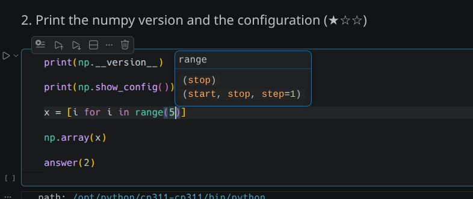
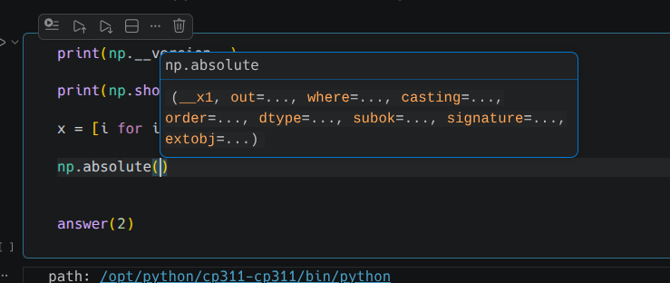
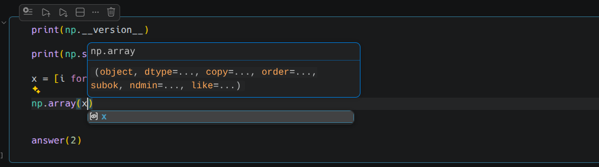

# Signature Hints

Parameter hints that behave. Names and defaults instead of type annotations,
syntax-coloured from your active theme, per-language exclusions, and `alt+h` for
the full documentation in a window big enough to read it.

Built for Python and Jupyter notebooks first; it works for any language that has
a signature help provider.



## What it does

| | Built-in parameter hints | Signature Hints |
|---|---|---|
| Syntax coloring | none, one flat color | full, from your active color theme |
| Signature shown | whatever the stub says, annotations and all | names and defaults only |
| Silence a function | impossible | `signatureHints.exclude` |
| Signature vs docs | always both | `signature` / `doc` / `both` / `none` |
| Reading the docs | scroll a 440px popup | `alt+h`, in the resizable hover |
| Overloads | one at a time, 1/2 navigation | stacked, with repeats folded away |

### Compact signatures

Typed stubs are written for type checkers, not for reading. Pylance reports:

```
(*values: object, sep: str | None = " ", end: str | None = "\n",
 file: SupportsWrite[str] | None = None, flush: Literal[False] = False) -> None
```

which wraps to five lines in a 440px popup. `signatureHints.signatureStyle`
defaults to `compact`, which keeps the part you were actually looking for:

```
print(*values, sep=" ", end="\n", file=None, flush=False)
```

This matters most for the scientific stack — numpy, pandas, matplotlib,
scikit-learn — whose annotations (`_ArrayLike`, `_OrderKACF`,
`_SupportsArrayFunc | None`) are longer than the parameter names they describe.
Set it to `full` to get the server's label verbatim.



Overloads that take the same arguments are folded into one. `np.array` declares
several that differ only in the *types* of theirs — which is what compact mode
has just hidden — so one line is all there is to say:



`range` keeps both of its overloads, because one argument and three really are
two different calls.

The colors are read from the color theme you actually have active — including
themes that ship inside VS Code, themes you installed, and any
`editor.tokenColorCustomizations` you layered on top. Switch theme and the popup
follows, no reload.

## Requirements

The popup is VS Code's own parameter hints widget, so
`editor.parameterHints.enabled` must be `true`. If it is off, the extension
offers to turn it on the first time it starts.

## Settings

| Setting | Default | Meaning |
|---|---|---|
| `signatureHints.enabled` | `true` | Off gives you back VS Code's own parameter hints. |
| `signatureHints.mode` | `"signature"` | `signature`, `doc`, `both`, `none`. |
| `signatureHints.reopenInsideCalls` | `true` | Re-open the popup when the cursor moves back between the parentheses. |
| `signatureHints.signatureStyle` | `"compact"` | `compact` keeps names and defaults; `full` keeps annotations too. |
| `signatureHints.exclude` | `{"python": ["print"]}` | Calls that never show a popup. |
| `signatureHints.upstreamTimeoutMs` | `250` | Wait before falling back to the last remembered answer. |
| `signatureHints.maxDocLines` | `0` | Lines of docstring before truncating; `0` keeps all of it. |
| `signatureHints.overloads` | `"all"` | `all` puts everything in one scrollable popup; `active` uses the 1/5 buttons. |
| `signatureHints.maxOverloads` | `0` | Cap when stacking; `0` is no cap. |
| `signatureHints.header` | `"name"` | Content of the plain header line: `none`, `name`, `name+count`. |
| `signatureHints.colors` | `"theme"` | `off` disables coloring. |
| `signatureHints.highlightActiveParameter` | `false` | Mark the argument under the cursor. |
| `signatureHints.monospace` | `true` | Render the signature in the editor font. |
| `signatureHints.languages` | `["*"]` | Language ids to take over. |

Everything except `languages` is language-overridable, so you can scope it:

```jsonc
"signatureHints.mode": "signature",
"[python]": {
  "signatureHints.mode": "both",
  "signatureHints.maxDocLines": 20
}
```

### Exclusions

`print` is a Python builtin and `console.log` is not, so exclusions are keyed by
language id. `*` applies to every language.

```jsonc
"signatureHints.exclude": {
  "python": [
    "print",         // also matches builtins.print
    "logging.*",     // logging.info, logging.debug
    "np.random.*",
    "torch.**"       // any depth
  ],
  "javascript": ["console.*"],
  "*": ["assert"]
}
```

Patterns are globs, tested against both the bare name and the qualified name.
`*` does not cross dots; `**` does. A flat array still works and applies to
every language.

`Signature Hints: Exclude Call at Cursor` adds whatever you are inside to the
list, under the current file's language.

## Reading the docs: `alt+h`

The parameter hints popup is small by construction. For the full documentation,
`alt+h` opens VS Code's hover — the wide, scrollable, resizable one you get with
the mouse — and it works from two places:

- **On a function name**, it is exactly the mouse hover.
- **Inside the call's parentheses**, where there is normally nothing to hover,
  the extension supplies the callee's documentation instead. `np.array(|)` gives
  you `np.array`'s docs.

The parameter hints popup closes first — the two widgets are anchored to the same
spot and would overlap.

Press `alt+h` **again** to move focus into the hover, then scroll it with the
arrow keys; `Escape` closes it — including inside a notebook cell, where it would
otherwise drop you out of the cell (see below). Drag its edge once to make it bigger and VS Code
reuses that size for every later hover.

Hovering with the mouse is untouched: the provider only answers when you press
the key.

To frame it in VS Code's focus blue — the one around a selected notebook cell:

```jsonc
"workbench.colorCustomizations": { "editorHoverWidget.border": "#0078D4" }
```

The hover is a shared widget, so this colors mouse hovers too. `#0078D4` is Dark
Modern's `focusBorder`; use `"editorHoverWidget.border": "#00000000"` to go back.

## Turning it off

`signatureHints.enabled: false` makes the extension **step aside**, so VS Code's
own parameter hints come back — it is not a way to hide the popup. For that, use
`signatureHints.mode: "none"`, which suppresses it without touching
`editor.parameterHints.enabled`.

### `Escape` in a notebook

`HideHoverAction` is registered with no keybinding at all: the hover closes on
`Escape` through a DOM listener inside the widget, which does not consume the
key. In a plain editor nothing else is listening, so it looks like a normal
binding. In a notebook cell, `notebook.cell.quitEdit` is also bound to `Escape`
and still fires — so the hover closed *and* you left the cell.

The extension contributes the missing binding:

```jsonc
{ "command": "editor.action.hideHover", "key": "escape",
  "when": "editorHoverVisible && notebookEditorFocused" }
```

Extension keybindings outrank built-in ones, so this wins and `quitEdit` does not
run. It is scoped to notebooks and to a visible hover, so `Escape` keeps its
usual meaning everywhere else.

### `Escape` with VSCodeVim

The popup's and the hover's `Escape` bindings win the key over VSCodeVim's
own, so on their own they would close the popup and leave you in Insert mode.
They hand it on: the popup closes **and** Vim goes back to Normal mode, as
`Escape` does without the popup. In Normal mode it only closes the popup.
Without VSCodeVim nothing changes.

## Commands

| Command | Key |
|---|---|
| Signature Hints: Show Documentation at Cursor | `alt+h` |
| Signature Hints: Toggle On/Off | — |
| Signature Hints: Cycle Mode | — |
| Signature Hints: Exclude Call at Cursor | — |
| Signature Hints: Reclaim Provider Priority | — |
| Signature Hints: Show Diagnostics | — |

## One scrollable popup

Every overload goes into a single popup — first signature at the top, the others
under it. No `1/5` `2/5` buttons to click through; scroll instead. VS Code caps
the widget and makes it scrollable:

```js
updateMaxHeight() {
  const t = `${Math.max(this.editor.getLayoutInfo().height / 4, 250)}px`;
  this.domNodes.element.style.maxHeight = t;
}
```

Overloads that take the same arguments are folded into one first. `range` keeps
its two — one argument, or three — while `np.array`'s differ only in the types of
theirs, which compact mode hides anyway, so it shows a single line.

So the popup is never taller than a quarter of your editor, and the rest is one
wheel-scroll away. `signatureHints.overloads: "active"` brings the navigation
buttons back if you prefer them.

Note the `height / 4`: the cap scales with the **editor's** height, so a taller
editor pane means a taller popup. It never goes below 250px, which is what a
notebook cell always gets. To lose a small residual scroll, either lower
`maxOverloads` or give the editor more room.

Note what this does *not* do: the widget's height follows its content, up to that
cap. It does not start small and expand as you scroll — nothing in VS Code does
that, and an extension cannot add it. Keeping the popup to one or two lines means
putting less in it, which is why `mode` defaults to `signature` and the
documentation lives behind `alt+h`.

### Coming back into a call

VS Code starts parameter hints on `(` and `,`, and afterwards only keeps them
alive while they are already showing. Leaving `np.array(x)|` and coming back to
`np.array(x|)` shows nothing, and typing does not help — none of it is a trigger
character.

`signatureHints.reopenInsideCalls` (on by default) watches the cursor and
re-triggers when it lands back inside a call. Moving between arguments of the
*same* call is left alone, so pressing `Escape` keeps it closed until you leave
and come back.

### Overlap with the suggestion list

The parameter hints popup asks to be placed **above** the cursor
(`preference: [ABOVE, BELOW]`), and the suggestion list takes the space below.
When there is no room above — cursor near the top of the viewport, or the first
lines of a notebook cell — the popup falls back to *below* and lands on top of
the suggestion list.

This is VS Code's own behavior: nothing hides one for the other, and a widget's
placement is not something an extension can influence. What is under your control
is how much room the popup needs, since a shorter one fits above more often:
`maxOverloads: 1`, or `mode: "signature"` (the default).

If suggestions popping up while you type arguments is the real annoyance:

```jsonc
"[python]": { "editor.quickSuggestions": { "other": false } }
```

Suggestions then only appear on `ctrl+space`, and `Escape` dismisses the list
without closing the parameter hints.

### What cannot be changed

The width is fixed by VS Code's own stylesheet:

```css
.parameter-hints-widget > .phwrapper { max-width: 440px }
```

A literal, not a CSS variable. No setting exposes it and extensions cannot inject
workbench CSS, so **the parameter hints popup cannot be widened** — only its
content shortened. `alt+h` exists because of this: the hover widget has none of
these limits.

Its placement is VS Code's too. A tall content widget gets flipped above the
line and pinned to the viewport edge, which is why it can end up far from the
cursor. Less content keeps it close:

| Setting | Effect |
|---|---|
| `signatureHints.signatureStyle: "compact"` | Usually turns five wrapped lines into one. |
| `signatureHints.mode: "signature"` | Drop the docstring; read it with `alt+h`. |
| `signatureHints.maxDocLines` | `4` keeps only the summary. |
| `signatureHints.maxOverloads` | Cap the stack. |

## The header line

VS Code always draws a plain, uncolored line above the documentation area:

```js
this.domNodes.signature.innerText = "";
const n = append(this.domNodes.signature, $(".code"));
…
this.domNodes.signature.classList.toggle("has-docs", l);
```

`.signature` is created unconditionally, gets `padding: 4px 5px`, and a 1px
separator once there are docs — about 13px whether or not there is anything in
it. Nothing an extension returns collapses it, and extensions cannot inject CSS
to hide it. **It cannot be removed.**

Since the space is spent either way, `signatureHints.header` defaults to `"name"`
and puts the function name there. The name is then dropped from the colored
signature, so it never appears twice; `"none"` moves it back down and leaves the
line blank.

With `monospace` on, VS Code draws a background pill behind the signature. To
remove it:

```jsonc
"workbench.colorCustomizations": { "textCodeBlock.background": "#00000000" }
```

## How it works

The extension registers its own signature help provider, asks the real language
server (Pylance, tsserver, rust-analyzer…) for the signature, and re-renders it
as colored HTML into the widget's `documentation` field — the one part of the
built-in popup that goes through VS Code's markdown renderer.

Two consequences worth knowing:

- **The language server cannot be switched off.** VS Code has no API to disable
  another extension's provider, and Pylance has no setting for it either — 86
  `python.analysis.*` settings and not one that turns signature help off. The
  only lever anyone has is registration order, which is why this extension
  bothers with it at all.
- **Holding the lead.** `(` is a trigger character, so VS Code asks providers the
  instant it is typed — or the instant `Tab` accepts a completion ending in one.
  Reacting after that is too late, so the extension keeps its registration newest
  continuously, checked on every cursor move and edit. It re-registers only when
  the chain has not reached it for the current revision, which is never true while
  its own popup is up, so this costs nothing during normal use.
- **Provider order.** VS Code orders equally-scored providers newest-first, so
  whoever registers last wins, and a provider that is not first is simply never
  called. Pylance registers when its language server finishes starting — often
  20s or more into a session with large typed stubs — so the extension keeps
  re-registering on a backoff for the first minute, and reclaims the lead
  whenever the cursor enters a call after 5s without being reached — language
  servers restart and re-register, which puts them back in front.
  `Signature Hints: Show Diagnostics` reports which languages have been served
  and how long ago; `signatureHints.trace` logs every call. If the built-in popup
  shows and the trace stays empty, the provider order is the problem and
  `Signature Hints: Reclaim Provider Priority` fixes it on the spot.
- **HTML in the popup is not a contractual API.** It is the behavior of VS Code's
  shared markdown sanitizer, which allows `color`, `background-color` and
  `border-radius` on `<span>`. Verified against VS Code 1.131. If a future release
  tightens it, set `signatureHints.colors: "off"` until the extension is updated.

## Development

```sh
npm install
npm run compile   # or: npm run watch
```

Press `F5` for an Extension Development Host. `npm run package` builds the `.vsix`.
